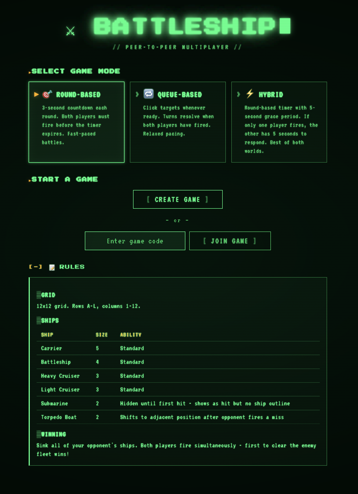
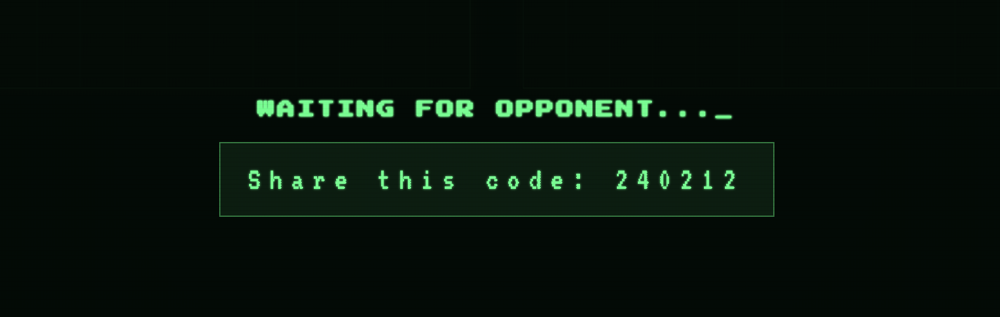
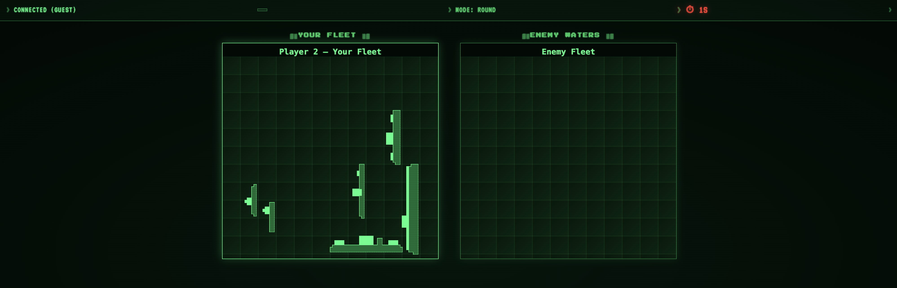

# 📸 Screenshots

A quick visual tour of **Battleship P2P** — from picking a mode to firing the first salvo.
Click any thumbnail to view it full size.

---

### 🟢 Start Screen

Pick your game mode — _Round-Based_, _Queue-Based_, or _Hybrid_ — then create a game or join
with a 6-character code. The rules and full fleet roster are right there on the landing screen,
rendered in the game's retro CRT terminal style.

---

### 🔑 Share &amp; Connect

Created a game? You get a 6-character code. Share it with a friend over chat, DM, or carrier
pigeon — the game waits peer-to-peer until they join. No accounts, no server-side game state.

---

### 🔥 Gameplay

Battle stations. Your fleet sits on the left grid in blocky retro sprites; enemy waters wait on
the right. Click to fire, watch for hits and splashes, and sink all six ships to win.

---

[← Back to the README](../README.md)
